Escape from TUES
=======

This is the first game that I made when I was 15-16 - written in pascal - TUES was my school and the point is to escape to the bottom left corner of the building. You control a character and move with the arrow keys to run away from the cleaners.

Many thanks to [qweqq](https://github.com/qweqq) for teaching me how to code and telling me to fix idiotic code.

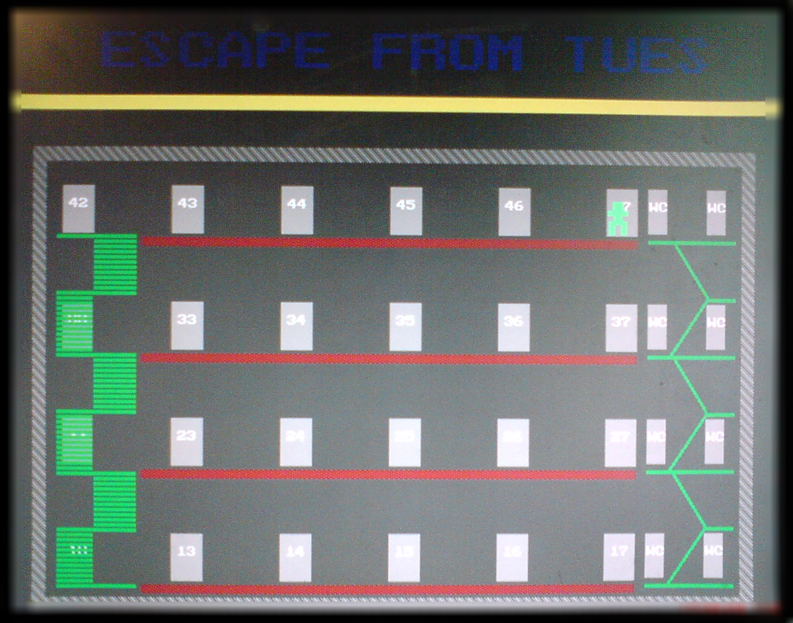

- Release date: 29/11/2007
- Time to write the game - ~60 hours spread over 6 months.
- Code is horrible - lots of copy/paste, bad variable naming, global variables, bad indentation (for example [here](https://github.com/onqtam/old-stuff/blob/master/escape_from_tues/main.pas#L3934)).
- All graphics are procedural (and took a ton of time to get the coords right!).
- The code was last built with borland pascal under Windows XP but I'm not sure it will build out of the box.
- I was even using pointers without knowing what they are - copy/pasted from the borland pascal examples.
- Screenshots were made with a camera because printscreen didn't capture anything (perhaps because using pascal crt for drawing).
- The installer can still be found in various torrent trackers across the world! :laughing:

**escape_from_tues_fixed_edition_installer.exe** - a Windows installer that maybe works in Windows XP... "fixed edition" means that if you say in the game that you don't like it (it will ask you...) there will be no **f_you.bat** file copied to your startup folder with ```shutdown -s``` in it...

Here are a bunch of screenshots:

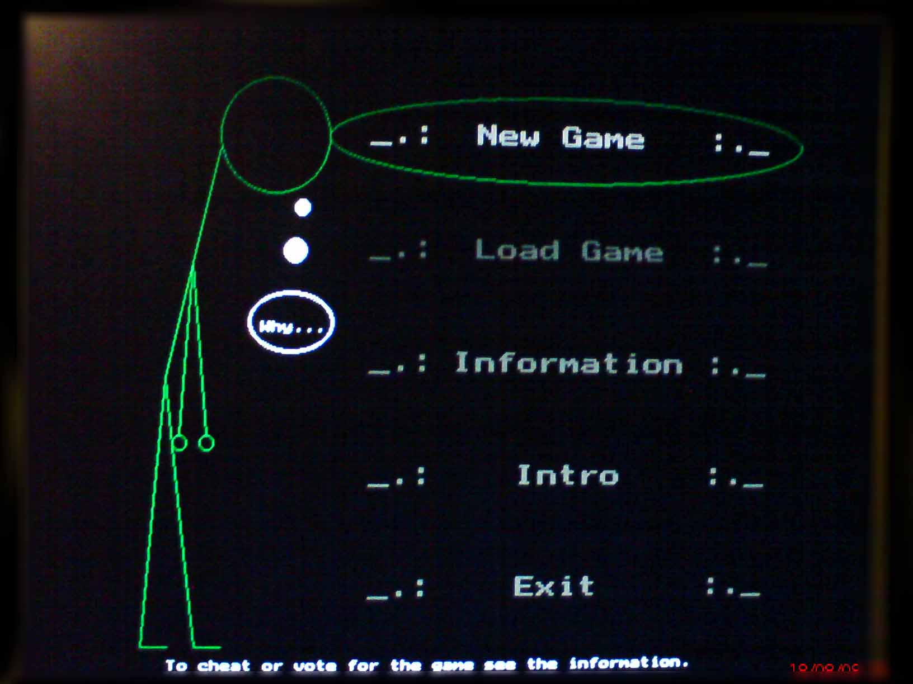
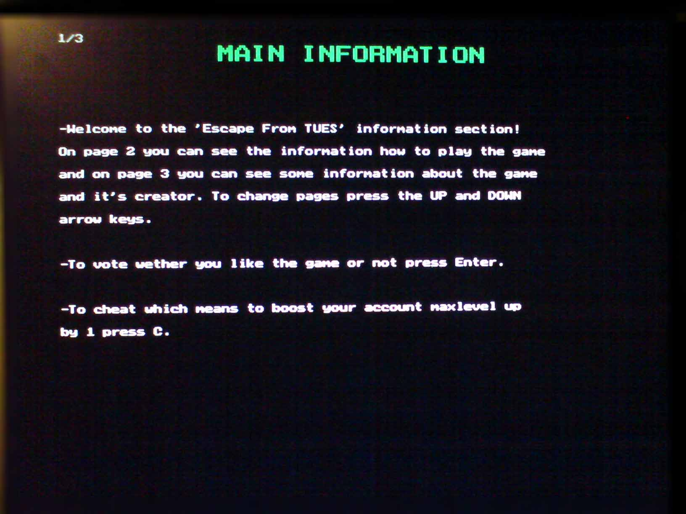
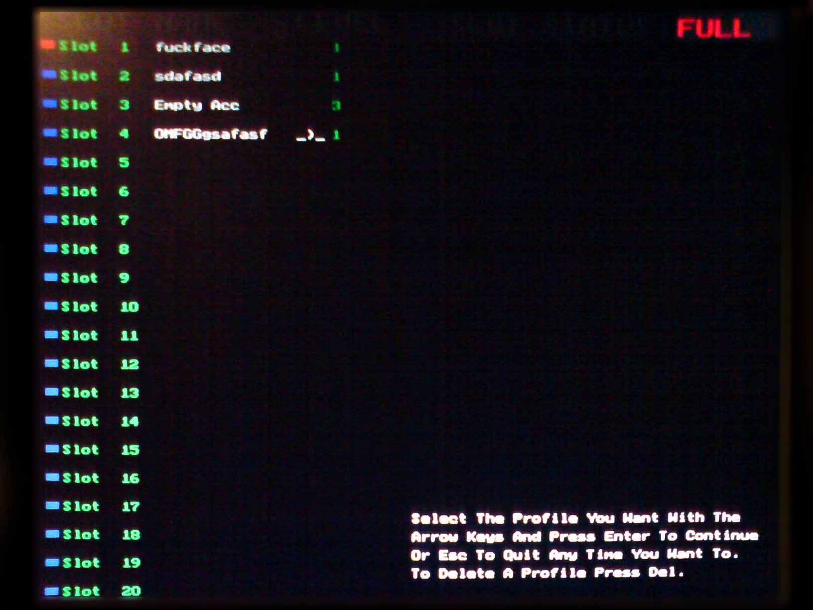
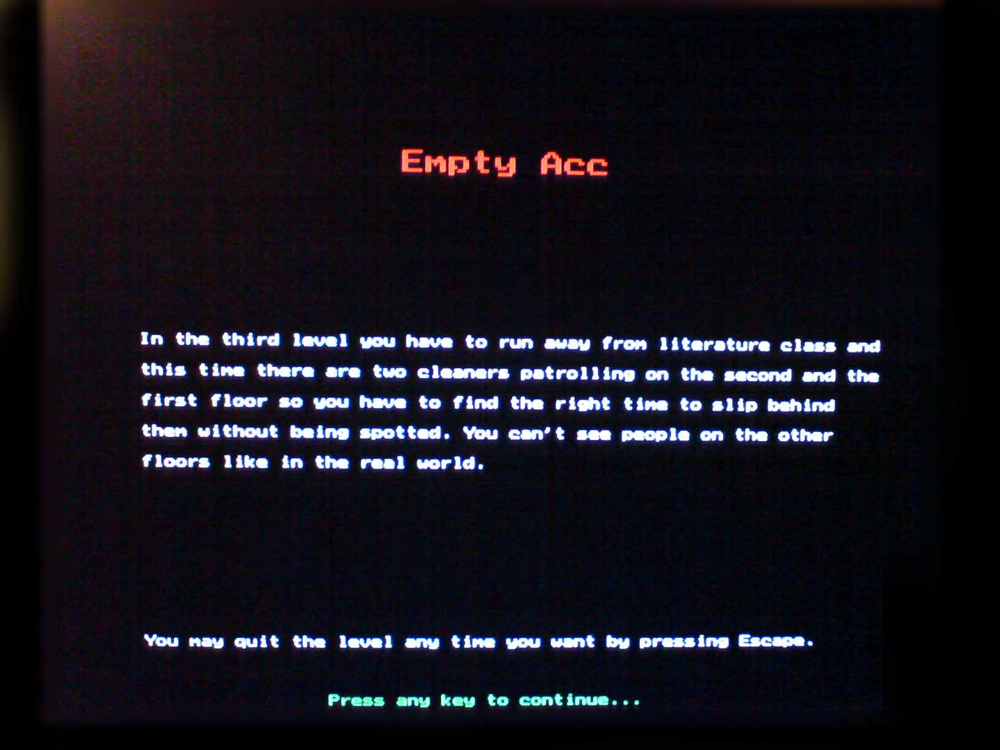
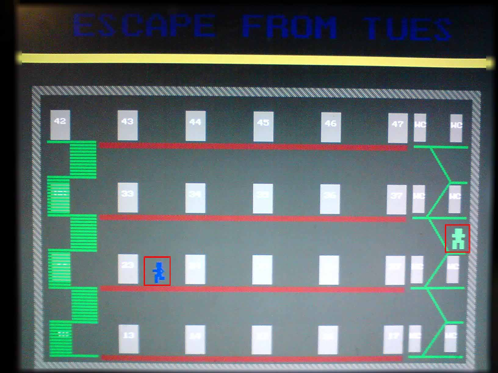
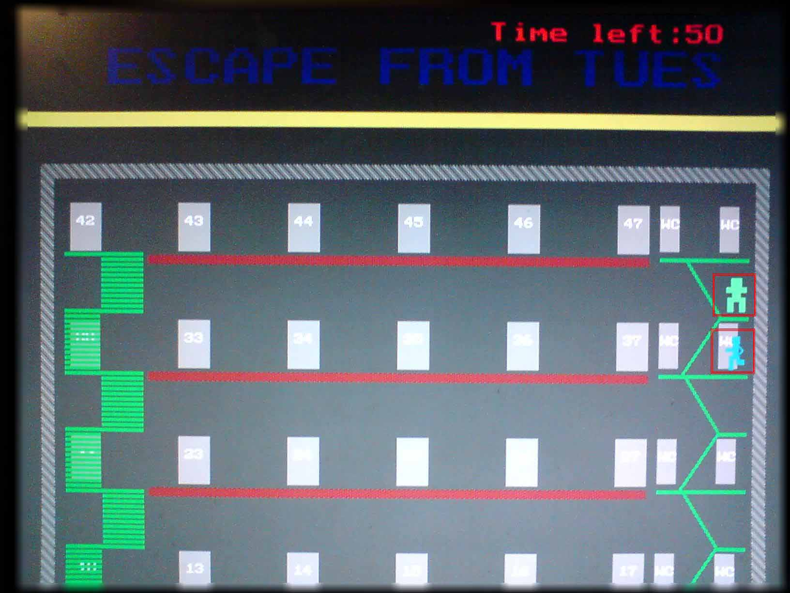
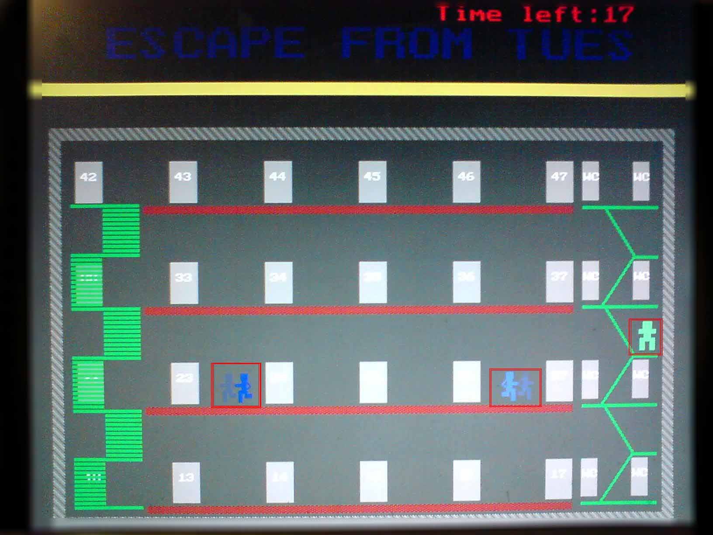
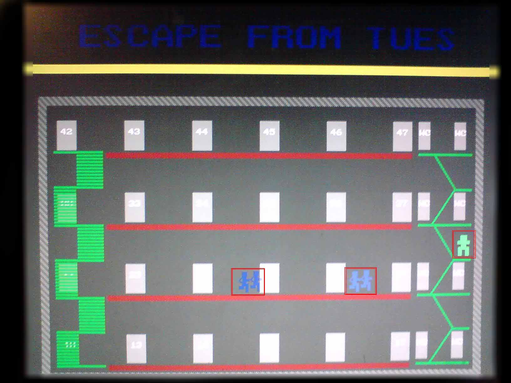
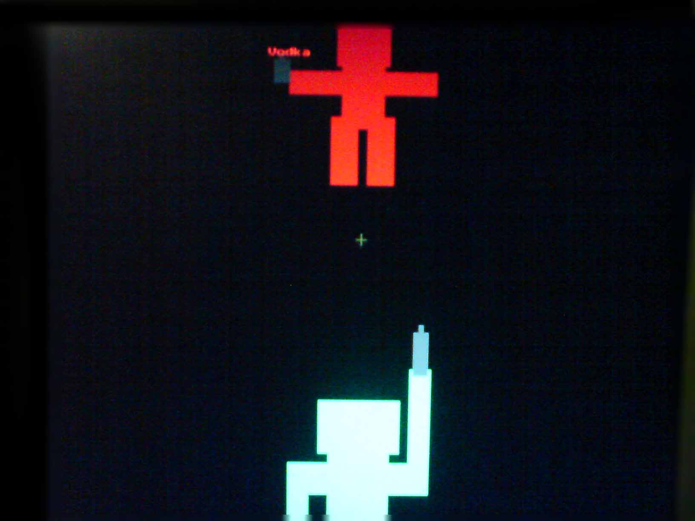
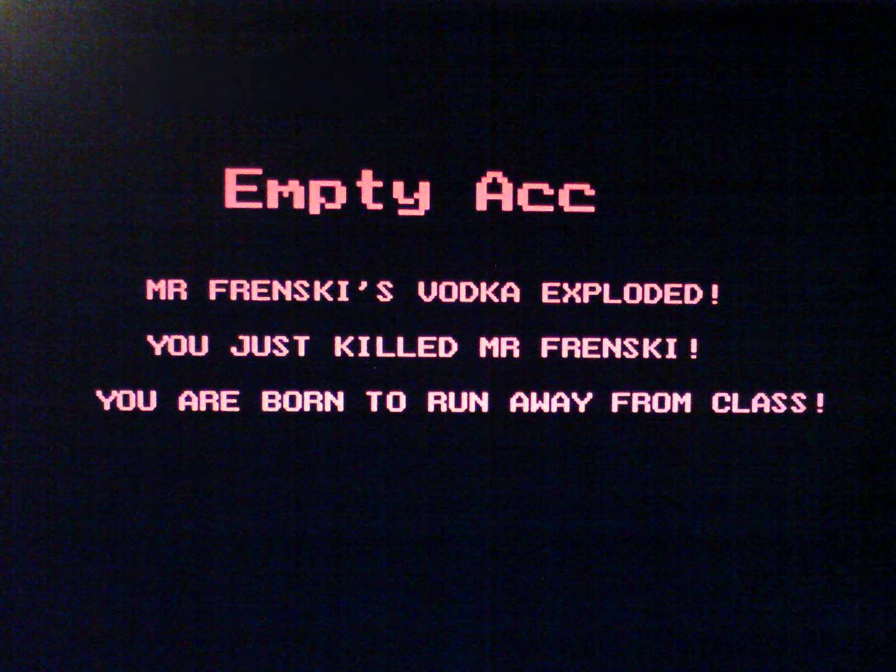
