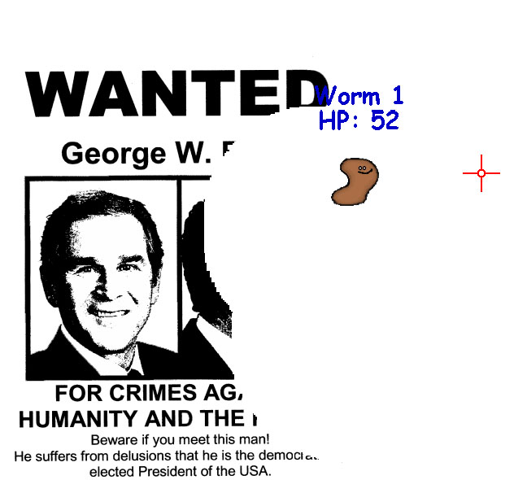
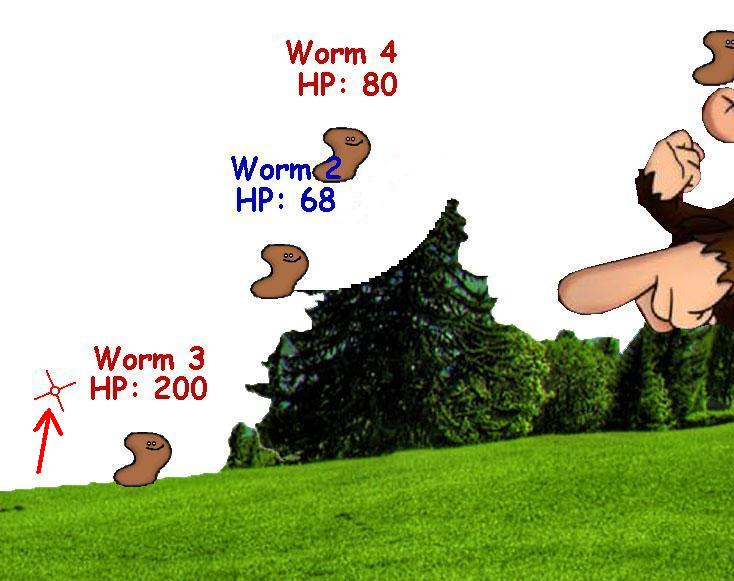
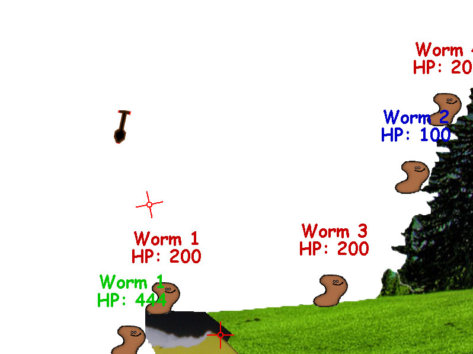
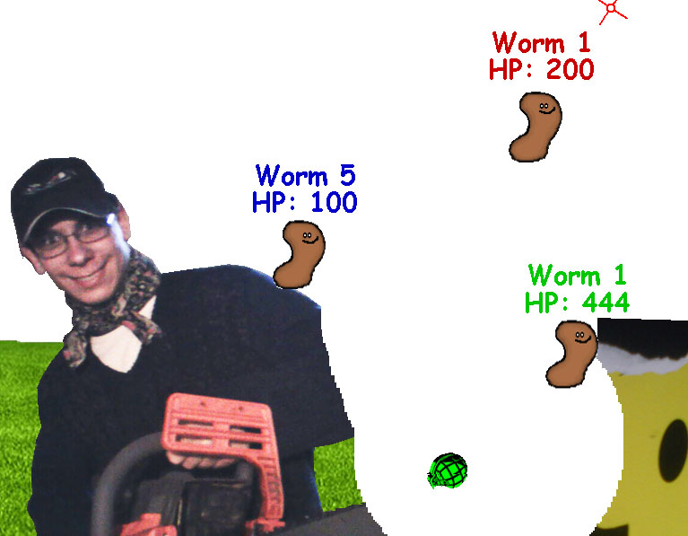
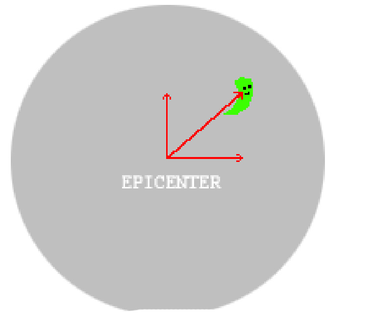

Pop Shots
=======

A Worms 'clone' - done in 5 months as a thesis in 12th grade when I was 18 - it is still not clear whether these are worms, peanuts or shits. This code can also be found [here](https://github.com/elsys/Victor_Kirilov_Worms).

- Used SDL 1.2 (also SDL_image and SDL_ttf)
- Made constructors with 17 parameters - [wtf](https://github.com/onqtam/old-stuff/blob/master/pop_shots/src/source/physicalobject.cc#L18).
- Felt the pain of inheritance and had no idea about composition - [wtf](doc/html/class_object.png).
- Windows build (```windows_executable.zip```) made with MSYS, MinGW and some cursing (Works on XP/Vista/7/8/10).
- Game has some glitches and bugs.
- Implemented gravity, wind, per-pixel collisions and explosions.
- No sound/ai/networking/gui due to time constraints.
- Game parameters can be changed from ```parameters.ini```

Controls (the current worm has it's sight on):

- Tab to switch the current worm
- The arrow keys to to move the worm and his aim
- Hold space to fire a weapon
- Use 1/2 to switch between the bazooka and grenades
- Enter to jump

Some screenshots:






