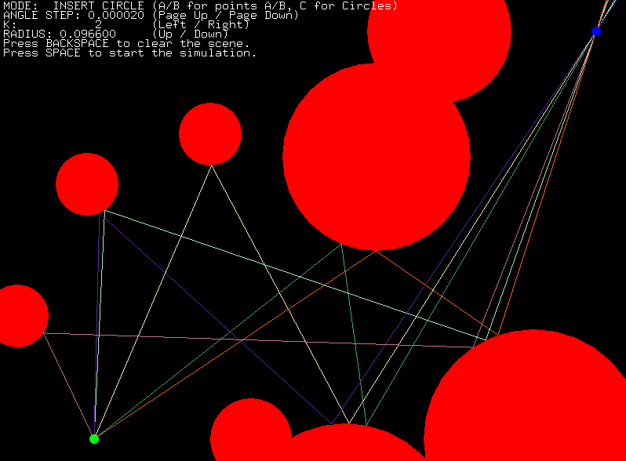
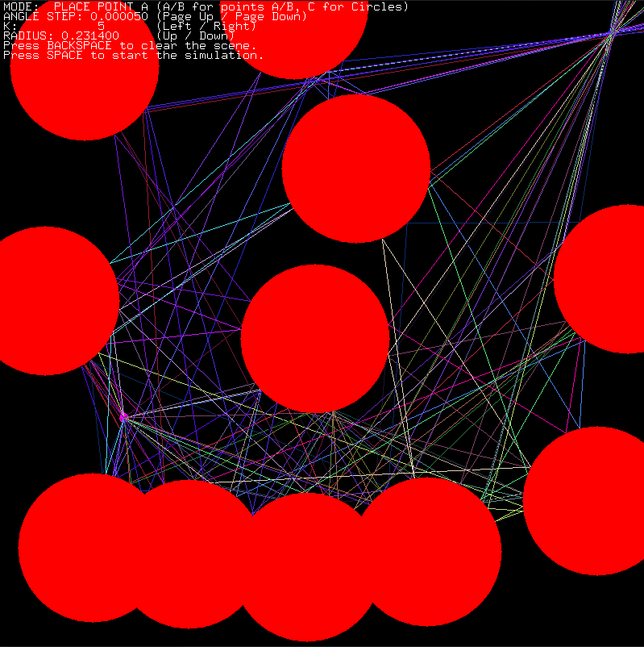
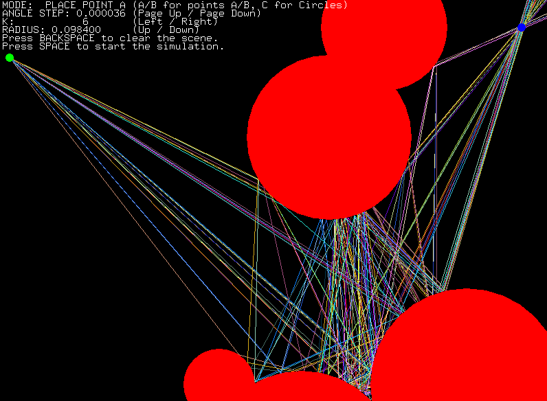

ray play
=======

Given a starting point A and an end point B find all ray paths between them which have K reflections from circles.

For example here is a screenshot of 6 paths from A to B with K = 2:



- Not all paths are guaranteed to be found - adjust the precision and wait more time for the results
- Project file is for Visual Studio 2015 in Release (also there is the pre-built ```Release/build.exe```).
- Use ```config.h``` to enable/disable/tweak parts of the program.
- Todo: kd tree for faster intersection with circles and parallelism (multi-threaded).

The program by default loads ```data/input.txt``` when started - it's format is:

- line 1: point A
- line 2: point B
- line 3: K (number of reflections)
- line 4: N (number of circles)
- line 5 to line 4 + N: the N circles

Controls:

- Up/Down - change the size of the circle which a mouse click would put.
- Left/Right - change K - the number of reflections for paths.
- Backspace - clear all added circles.
- Space - start finding paths with K reflections.
- Esc - quit the program.
- Page Up/Down - to adjust the precision.
- A/B/C - toggles circle addition mode or point A/B moving mode - with mouse clicks.

### How it works:

Basically I start firing rays from point A in every direction based on the precision used. When a ray has been reflected K times and goes near B within some small constant - I consider that a hit and the path is recorded.

There are 2 tricks I use to find more paths for roughly the same amount of time:

- I adjust the precision for the step (angle between rays fired from A) based on the angle between the last fired ray and the normal on the surface of it's first hitpoint (kind of importance sampling - based only on the first reflection - could be done for all reflections in a chain).

|normal                                                    |adaptive precision                                           |
|----------------------------------------------------------|-------------------------------------------------------------|
|the rays spread more near the end of the circle           |the rays spread evenly even after they get reflected         |
|                              |                               |
|29 paths found                                            |173 paths found                                              |
|                     |                     |

- If point B ends up between 2 consecutively fired rays after K reflections but none of the rays 'hits' point B (meaning they aren't close enough to it) - then I start a binary search between these 2 rays until I hit point B.

|normal                                                    |binary search in interval                                    |
|----------------------------------------------------------|-------------------------------------------------------------|
|7 paths found                                             |39 paths found                                               |
|                               |                                   |

Here is an example of 8k paths from A to B with K = 16 (took a few minutes to find them with a step of 0.000009 radians and both tricks on)


